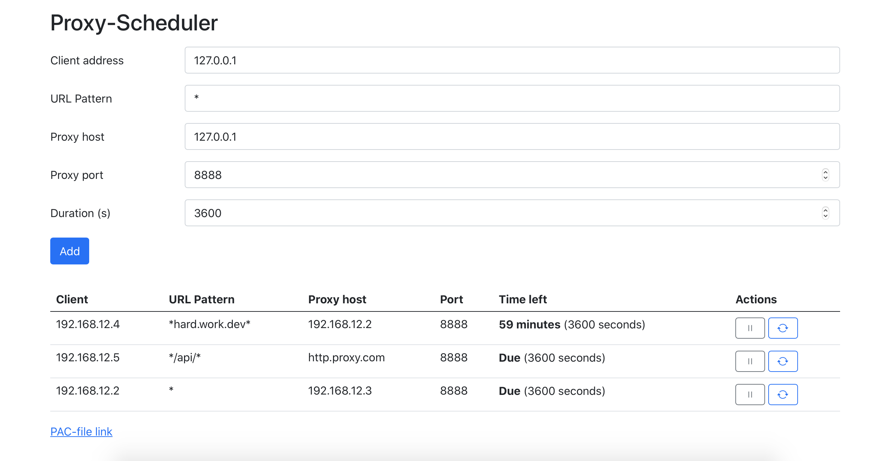

# Proxy-Scheduler

Project aims to simplify web debugging via proxy, but would be also useful for some tricky network setup with multiple different proxies for different domains. 



## Installation

First you need to clone the repo and open it in the terminal. There is no preferred way to deploy, but we find docker to be the easy way. 

### Docker

```
docker-compose up -d
```

### Usage

Clients are detected by the IP address inside the network. URL to put into the proxy-autoconfiguration is down below and it's called PAC-file link. On iOS devices proxy setting is in the wifi -> `i` button near your network -> Proxy at the bottom -> Automatic.

After adding new rules for the proxy easiest for the device to catch it – is to switch WiFi off and on from the Control Centre. Otherwise rules will be refreshed within minutes.

### Development

For the small deployments and development purposes built-in PHP server should be enough:

```
composer install
php -S 0.0.0.0:8905
```
